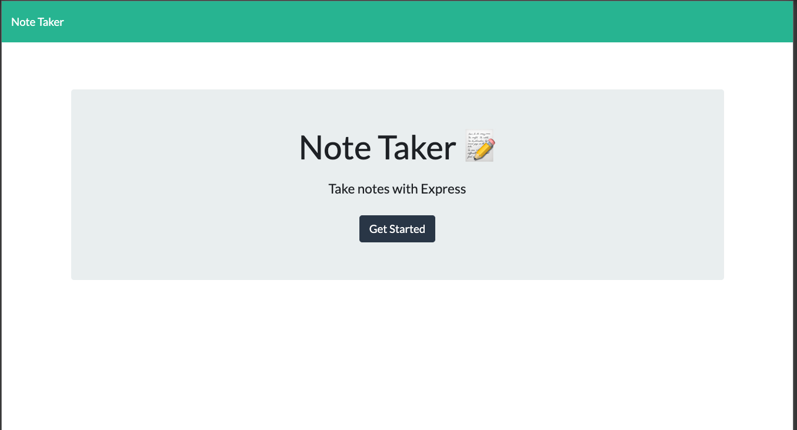

# Note Taker

## Description

Application that can be used to write, save, and delete notes. This application will use an express backend and save and retrieve note data from a JSON file.

* Includes the following HTML routes:

  * GET `/notes` - Returns the `notes.html` file.

  * GET `*` - Returns the `index.html` file

* The application has a `db.json` file on the backend that will be used to store and retrieve notes using the `fs` module.

* The following API routes are created:

  * GET `/api/notes` - Reads the `db.json` file and return all saved notes as JSON.

  * POST `/api/notes` - Receives a new note to save on the request body, add it to the `db.json` file, and then return the new note to the client.

  * DELETE `/api/notes/:id` - Receives a query parameter containing the id of a note to delete. 

## User Story

AS A user, I want to be able to write and save notes

I WANT to be able to delete notes I've written before

SO THAT I can organize my thoughts and keep track of tasks I need to complete

## Business Context

For users that need to keep track of a lot of information, it's easy to forget or be unable to recall something important. Being able to take persistent notes allows users to have written information available when needed.

